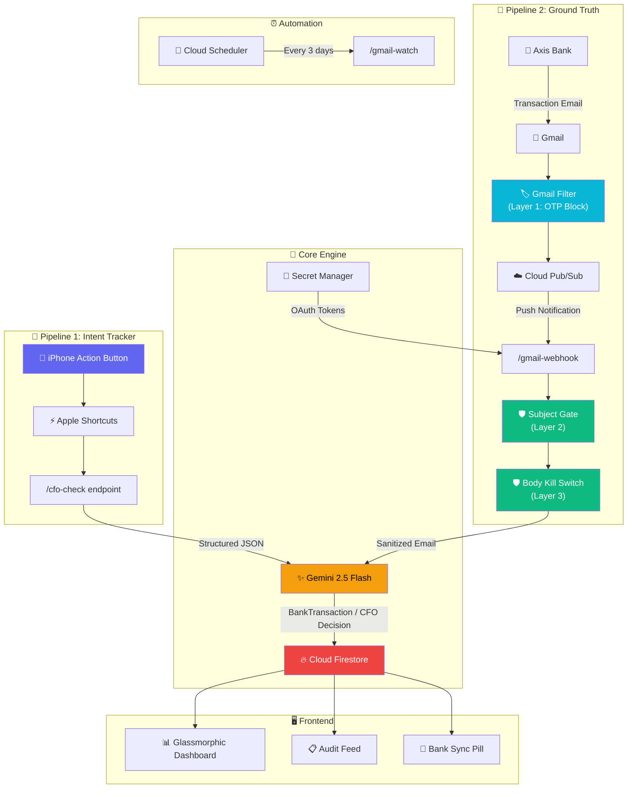

# 💰 AgentCFO — AI Financial Guardian

An autonomous, real-time financial guardian that **tracks your spending via voice commands AND automatically reconciles real bank transactions from Gmail**. Powered by **Gemini 2.5 Flash**, **Google Cloud Firestore**, **FastAPI**, and a **Dual-Pipeline Architecture** that bridges intent with reality.

> **Live**: [https://cfo.sam18.xyz](https://cfo.sam18.xyz) · **Region**: `us-central1` · **Warm Instances**: 1 (zero cold-start)

---

## 🏗️ System Architecture



### Dual-Pipeline Flow

```
┌─────────────────────────────────────────────────────────────────────┐
│                        DUAL-PIPELINE ARCHITECTURE                   │
├─────────────────────────────────┬───────────────────────────────────┤
│   PIPELINE 1: INTENT TRACKER   │   PIPELINE 2: GROUND TRUTH        │
│                                 │                                   │
│   iPhone Action Button          │   Gmail ← Axis Bank               │
│         ↓                       │         ↓                         │
│   Apple Shortcuts               │   Gmail Filter (Layer 1)          │
│         ↓                       │   ├─ Label: CFO-Transactions      │
│   POST /cfo-check               │   └─ Blocks: OTP, PIN emails     │
│         ↓                       │         ↓                         │
│   Gemini 2.5 Flash              │   Cloud Pub/Sub                   │
│   ├─ Intent classification      │         ↓                         │
│   ├─ Spending approval/roast    │   POST /gmail-webhook             │
│   └─ Balance update             │   ├─ Subject Gate (Layer 2)       │
│         ↓                       │   ├─ Body Kill Switch (Layer 3)   │
│   Firestore                     │   └─ Gemini Email Parser          │
│   └─ cfo_state/wallet           │         ↓                         │
│                                 │   Firestore Reconciliation        │
│   "Can I spend ₹300 on food?"   │   └─ Real debit/credit applied   │
│   → Agent says YES, deducts 300 │                                   │
│   → Actual bill was ₹340        │   Bank email: "₹340 debited"      │
│   → Agent doesn't know ❌       │   → Auto-corrects to ₹340 ✅     │
└─────────────────────────────────┴───────────────────────────────────┘
```

---

## 🛡️ 3-Layer OTP Defense Architecture

Since Axis Bank sends **both** transaction alerts and OTPs from the **same email** (`alerts@axis.bank.in`), a deterministic security firewall prevents OTPs from ever reaching the AI:

| Layer | Location | Mechanism | What It Blocks |
|:---:|:---|:---|:---|
| **1** | Gmail Filter | Label-based filter with negative keyword match | Emails containing `OTP`, `One Time Password`, `verification`, `PIN` never get labeled |
| **2** | Python (Subject) | Regex scan on email subject line | Subjects containing OTP-related keywords → immediately rejected |
| **3** | Python (Body) | HTML/text body scan before Gemini sees it | Bodies containing OTP patterns (e.g., `\b\d{4,8}\b` near "OTP") → body replaced with `[BLOCKED]` |

> **Rule**: Raw email bodies are **never logged** and **never stored**. Only the structured `BankTransaction` JSON output from Gemini is persisted.

---

## ⚡ Core Features

### Pipeline 1 — Intent Tracker (Voice)
- **iPhone Action Button**: Press → speak → get instant CFO verdict
- **9 Action Types**: `APPROVE_INTENT`, `REJECT_INTENT`, `ADD_FUNDS`, `LEND_MONEY`, `DEBT_COLLECTED`, `SET_EXACT_BALANCE`, `RETROACTIVE_DEDUCTION`, `QUERY_STATUS`
- **Brutal Spending Roasts**: Calculates runway decay percentages and delivers severe sarcastic burns
- **Debt Ledger**: Tracks money lent to friends with automatic collection

### Pipeline 2 — Ground Truth (Gmail)
- **Autonomous Bank Sync**: Axis Bank transaction emails → parsed → balance auto-reconciled
- **2 New Action Types**: `BANK_DEBIT`, `BANK_CREDIT`
- **Gemini Email Parser**: Extracts amount, merchant, channel (UPI/NEFT/IMPS), reference ID
- **Zero Human Intervention**: Works 24/7 — no manual entry required

### Dashboard
- **Glassmorphic Dark Mode**: Premium HSL design system with ambient glows
- **Trajectory Decay Curve**: Interactive SVG chart mapping runway decay
- **Bank Sync Indicator**: Live status pill showing last sync time
- **Unified Audit Feed**: Both voice commands and bank transactions in one timeline

---

## 🛠️ Technology Stack

| Layer | Technology |
|:---|:---|
| **Backend** | Python 3.13, FastAPI, Uvicorn |
| **AI Model** | Google Gemini 2.5 Flash |
| **Database** | Google Cloud Firestore |
| **Auth** | Google OAuth2 (Gmail readonly scope) |
| **Secrets** | Google Cloud Secret Manager |
| **Messaging** | Google Cloud Pub/Sub |
| **Scheduler** | Google Cloud Scheduler |
| **Hosting** | Google Cloud Run (`min-instances=1`) |
| **Domain** | `cfo.sam18.xyz` (Cloud Run domain mapping) |
| **Frontend** | Vanilla HTML5/CSS3/ES6 (No frameworks) |
| **Package Manager** | Astral `uv` |

---

## 📁 Repository Structure

```
personal-cfo/
├── main.py                     # FastAPI app — CFO agent + Gmail webhook + 3-layer security
├── pyproject.toml              # uv project manifest with all dependencies
├── uv.lock                     # Strict dependency lockfile
├── requirements.txt            # pip-compatible deps (for Cloud Build)
├── Procfile                    # Cloud Run entrypoint
├── .python-version             # Python 3.13
├── .env                        # Local secrets (Git-ignored)
├── .gitignore
│
├── scripts/
│   └── gmail_auth.py           # One-time OAuth2 consent flow (generates refresh token)
│
└── static/                     # Glassmorphic Web Client
    ├── index.html              # Semantic HTML5 layout
    ├── style.css               # Space-dark HSL design system (700+ lines)
    └── app.js                  # SVG charts, fetch calls, bank sync status
```

---

## 🚀 Setup Guide

### Prerequisites
- [Astral `uv`](https://github.com/astral-sh/uv)
- Google Cloud project with Firestore, Pub/Sub, Secret Manager, Gmail API enabled
- `gcloud` CLI authenticated

### Step 1: Clone
```bash
git clone https://github.com/sam0786-xyz/personal-cfo.git
cd personal-cfo
```

### Step 2: Environment Variables
```bash
# .env (local development)
GEMINI_API_KEY=your_api_key
GCP_PROJECT=your_project_id
```

### Step 3: Local Development
```bash
uv run uvicorn main:app --host 0.0.0.0 --port 8000 --reload
```

### Step 4: Gmail Ground Truth Setup

<details>
<summary><strong>Click to expand Gmail pipeline setup</strong></summary>

#### 4a. Enable GCP APIs
```bash
gcloud services enable gmail.googleapis.com pubsub.googleapis.com secretmanager.googleapis.com cloudscheduler.googleapis.com
```

#### 4b. Create Pub/Sub Topic & Subscription
```bash
gcloud pubsub topics create gmail-bank-alerts
gcloud pubsub subscriptions create gmail-bank-alerts-push \
    --topic=gmail-bank-alerts \
    --push-endpoint=https://your-domain.com/gmail-webhook
```

#### 4c. Grant Gmail Pub/Sub Permission
```bash
gcloud pubsub topics add-iam-policy-binding gmail-bank-alerts \
    --member="serviceAccount:gmail-api-push@system.gserviceaccount.com" \
    --role="roles/pubsub.publisher"
```

#### 4d. Create OAuth2 Credentials
1. Google Cloud Console → Credentials → Create OAuth Client → **Desktop app**
2. Download JSON → save as `scripts/client_secret.json`
3. Add your Gmail as a test user in OAuth consent screen

#### 4e. Run Auth Script
```bash
python scripts/gmail_auth.py
```

#### 4f. Store Secrets
```bash
echo -n "REFRESH_TOKEN" | gcloud secrets create gmail-refresh-token --data-file=-
echo -n "CLIENT_ID" | gcloud secrets create gmail-client-id --data-file=-
echo -n "CLIENT_SECRET" | gcloud secrets create gmail-client-secret --data-file=-
```

#### 4g. Create Gmail Filter
In Gmail Settings → Filters:
- **From**: `alerts@axis.bank.in`
- **Has**: `debited OR credited OR transaction OR paid OR received OR refund`
- **Doesn't have**: `OTP OR "One Time Password" OR verification OR PIN`
- **Action**: Apply label `CFO-Transactions`

#### 4h. Deploy & Activate
```bash
gcloud run deploy personal-cfo --source . --region us-central1 --allow-unauthenticated --min-instances 1
curl -X POST https://your-domain.com/gmail-watch
```

#### 4i. Auto-Renewal Scheduler
```bash
gcloud scheduler jobs create http renew-gmail-watch \
    --schedule="0 3 */3 * *" \
    --uri="https://your-domain.com/gmail-watch" \
    --http-method=POST
```

</details>

---

## 📱 iPhone Action Button Integration

Map your live server to the iPhone Action Button for **instant, anywhere-in-the-world** financial verdicts:

| Shortcut Block | Configuration |
|:---|:---|
| **Ask for Input** | Prompt: *"What do you want to buy?"* |
| **Get Contents of URL** | URL: `https://cfo.sam18.xyz/cfo-check` · Method: **POST** · Headers: `Content-Type: application/json` · Body: `{"expense_text": "Provided Input"}` |
| **Get Dictionary from** | Input: `Contents of URL` |
| **Get Value for Key** | Key: `message` in `Dictionary` |
| **Speak** | Input: `Dictionary Value` |

**Settings → Action Button → Shortcut → "Pitch to CFO"**

---

## 🔌 API Endpoints

| Method | Endpoint | Description |
|:---:|:---|:---|
| `GET` | `/` | Serves the dashboard |
| `POST` | `/cfo-check` | Intent tracker — voice/text spending check |
| `GET` | `/state` | Returns current balance, transactions, debts |
| `POST` | `/reset` | Resets runway balance to ₹5,000 |
| `POST` | `/gmail-webhook` | Receives Pub/Sub push notifications |
| `POST` | `/gmail-watch` | Registers/renews Gmail push notifications |
| `GET` | `/gmail-status` | Returns bank sync status |
| `POST` | `/gmail-set-label` | Configures the Gmail label filter ID |

---

## 📜 License

Personal project by [Mohammad Sameer](https://github.com/sam0786-xyz). Built with ❤️ and Gemini.
